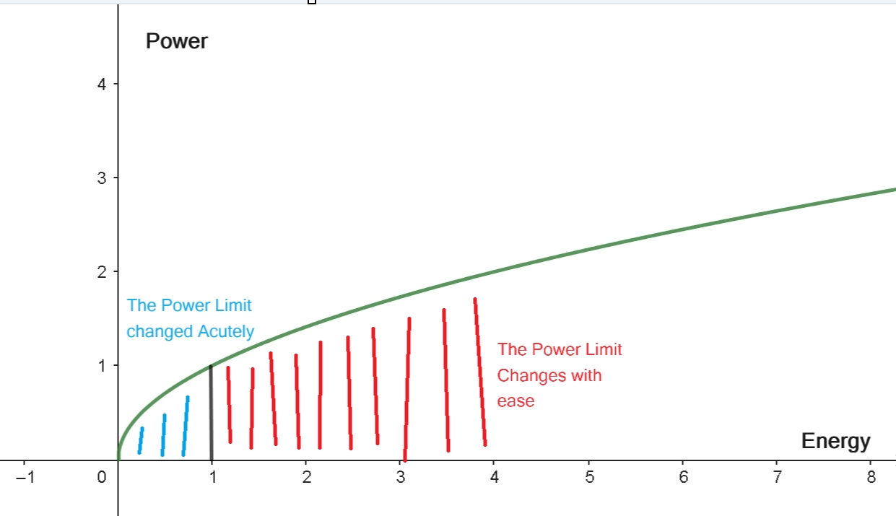
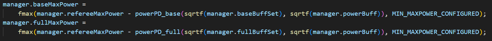
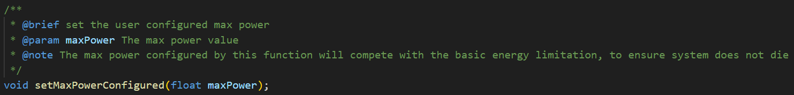
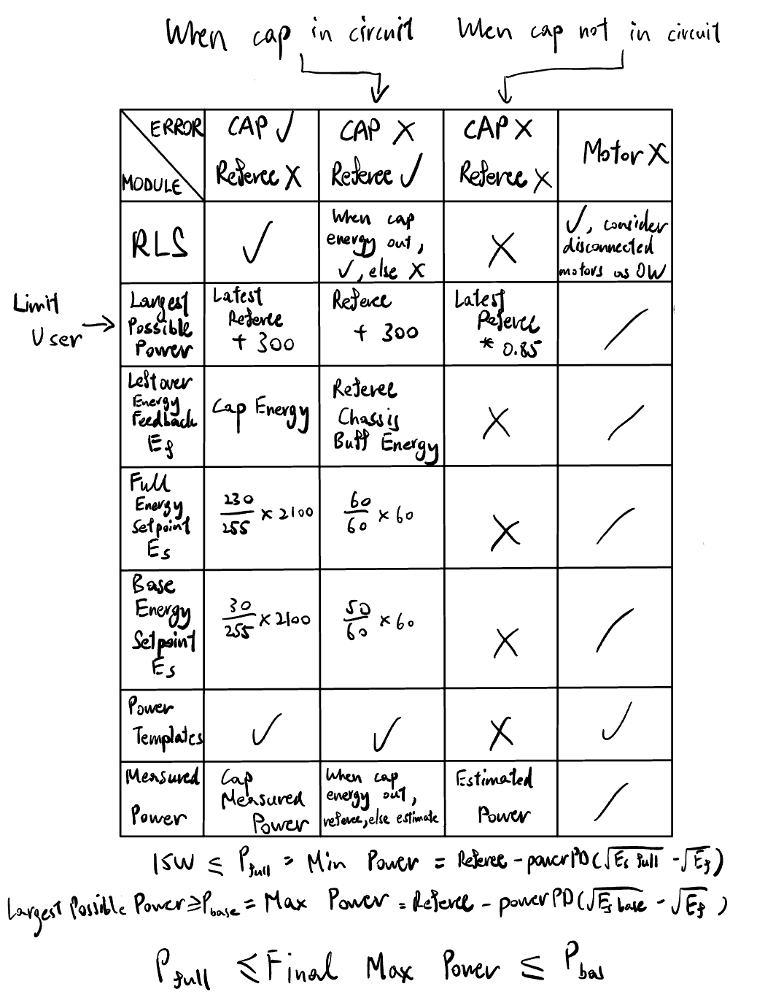
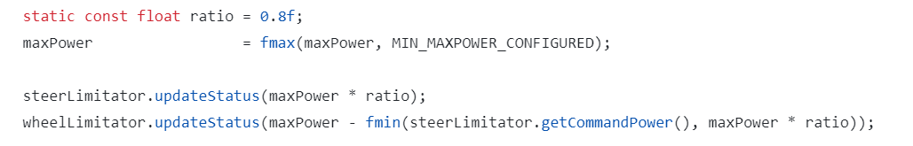

# 绪论

由于队内先前使用的功率控制模块存在一些潜在的问题，比如在软垫子和在坡上，本赛季基于此开发新的功率控制模块，开发需求主要有

* 强大的鲁棒性
* 更加简单的电机模型
* 方便调试和维护
* 更广的适用性

功率控制的本质上就是添加了一个额外的约束，相当于一个n轮的控制系统变得只有n - 1个力矩的自由度，功率控制变化的形式则在于如何控制这n - 1的自由度，即以一种最优的策略去添加其余n - 1的约束方程，使得电机输出后实际所消耗的功率降低到理想值，以达到功率控制的效果，同时又不影响底盘的正常运动。

我们可以首先将问题分解

* 首先是如何识别底盘系统，对底盘电机建立功率模型，通过模型来预测底盘电机所消耗的功率
* 其次是如何在指定的功率限制（例如裁判系统的功率限制）下约束和管理功率，而不影响底盘运动

# 底盘系统

我们的第一步是要识别底盘系统，如何不通过裁判系统和直接对电机作电流采样来预测电机所消耗的功率，以建立电机模型方便后续使用模型作约束。在本赛季中，我们并没有采用对电机母线电流直接采样的方案，而是通过有效的反馈（如电机反馈的力矩，转速），从而准确地预测底盘系统的功率消耗。

首先，我们对底盘的能量转换作分析，定义底盘的输入功率$P_{0}$, 实际电机输出的有效功率$P_{1}$，底盘系统的功率损耗有

$$
P_0 = P_1 + P_{loss}
$$

其中，$P_{0}$为底盘的总功率，即裁判系统限制的项，$P_{1}$为电机输出功率，由电机的实际输出转矩和实际转速得到（$P = \tau \omega$)，$P_{loss}$为功率损耗，也是此模型的重点。
能量主要由以下途径损耗：

* 铜损（如导线流过电流产生的热损耗）
* 铁损（如磁滞损，涡流损）
* 机械阻尼损耗（如电机减速箱产生的摩擦阻尼）
* 系统静态损耗（额外的线性偏差耗散功率项，如电机完全不输出时也消耗数瓦功率）
  因此，实际的功率损耗可能与电机的转速，力矩，转速的平方，力矩的平方等项均有关，经过简化，我们可以得到单个底盘电机所消耗的功率为

$$
{P}_i = \tau_i\omega_i + k_1\left|\omega_i\right|  + k_2\tau_i^2 + c
$$

| 描述                           | 符号       |
| ------------------------------ | ---------- |
| 第i个电机消耗的总功率          | $P_i$      |
| 第i个电机实际输出的力矩        | $\tau_i$   |
| 第i个电机实际的转速            | $\omega_i$ |
| 电机的静态损耗                 | $c$        |
| 电机转速产生的功率损耗系数     | $k_1$      |
| 电机力矩平方产生的功率损耗系数 | $k_2$      |

而综合底盘多个电机，我们得到了以下模型

$$
P = \sum_{i = 1}^{n}\bold{P}_i = \sum_{i = 1}^{n}\tau_i\omega_i + k_1\sum_{i = 1}^{n}\left|\omega_i\right|  + k_2\sum_{i = 1}^{n}\tau_i^2 + k_3
$$

其中，$P$为底盘总消耗功率，n为电机数量（标准4轮底盘则为4），$k_3$为整个底盘系统的静态损耗（$k_3 = \sum_{i = 1}^{n}c_i$，由于k3相对较小，我们也可以简单地直接认为$c = k_3 / n$)

此模型并不完全由力学分析和能量分析得到，但经过大量实验和经验，模型的准确度非常可观，而目前主流使用的功率模型也与此模型差不多，无非是着重于某些损耗项（有些功率模型考虑$\omega^2$），递归最小二乘法是一种自适应滤波器，用于通过递归方式估计参数值。在电机建模中，RLS可以动态地调整参数，以适应系统的变化和环境的影响。而唯一的问题在于如何得到$k_1$，$k_2$，和$k_3$的值。

# 递归最小二乘算法（RLS）

k1、k2、k3 是我们需要识别的参数

有三种方法可以实现这一目标：
A. 根据物理公式计算参数
B. 调整参数直到估计数据与统计测量数据相匹配，就像我们调整PID参数一样
C. 在系统运行时自动动态拟合参数

A和B的方法有明显的缺陷：

* 我们系统的物理模型比较复杂，可能很难手工计算出所有参数
* 同样，随机调整参数也不是很容易
* 随着环境的变化（如温度），参数可能会发生变化
* 为了识别不同的电机，我们需要重新调整参数

坦率地说，B实际上是一种常用的解决方法，通常最终可以奏效。但是仍然耗时，有时并不准确。
因此，我们尝试使用RLS来帮助我们拟合电机模型的参数。递归最小二乘法是一种自适应算法，用于通过递归方式估计参数值。在电机模型中，RLS可以动态地调整参数，以适应系统的变化和环境的影响。这不仅极大的减少了用户调参的时间，提高了模块的广泛适用性，不需要再对每个不同的底盘或是不同的电机手动调参。与其他团队不断费心调试相比，这种方法可以一劳永逸，非常便捷。

<video src="videos\rls.mp4"></video>

片中红色为电容反馈的底盘功率，绿色为电机模型预测的底盘功率，可以看到随着底盘的运动，预测的功率曲线逐渐收敛到电容测量的功率曲线。

经过长时间的实验和验证，可以确定的是电机模型的以及递归线性回归算法的有效性和稳定性。

对于$k_3$，也就是系统静态损耗，我们只需要简单的失能所有的底盘电机，并从裁判系统或电容反馈的底盘实时功率得知系统的静态功率损耗，取一段时间的平均值即为k3的值

对于$k_1$以及$k_2$，我们引入超级电容和裁判系统反馈的底盘实时功率，以根据变化的数据不断来调整我们所需要估计的参数

```
const Matrixf<dim, 1> &update(Matrixf<dim, 1> &sampleVector, float actualOutput);
```

# 功率环

约束的思路如下：

假设我们在每一时刻有一个功率上限 $P_{max}$ （暂且可以认为是裁判系统反馈的底盘功率上限）

经过底盘逆运动学解算和PID解算，我们得到了每一个底盘电机的输出。我们便能把输出代入电机模型以预测电机将会消耗的功率，$P_{cmd}$

1. $P_{cmd}$ <= $P_{max}$ 由於我們估計當前命令輸出不會超過功率限制，因此我們不必處理它，直接沿用PID控制器的输出
2. $P_{cmd}$ > $P_{max}$ 当预计功率超过了理想值，我们对他进行约束

我们要做的是

1. 给定当前时刻的功率最大上限$P_{max}$，分配功率给底盘的每个电机上使得$\sum_{i = 1}^{n}P_i = P_{max}$
2. 对每个电机所分配到的功率，利用电机模型得到电机允许输出的最大力矩

1.功率分配

对于一个底盘的最大功率上限$P_{max}$，我们不能简单的平均的将其分配给四个轮电机。而如果直接通过给每个轮电机的力矩输出乘一个衰减系数，会破坏底盘的运动学解算，导致走不了直线等问题（布朗运动XD）。
为了保证功率控制不影响底盘正常运动，这里采用两种分配功率的方法

* 等比缩放
* 大P分配

我们主要根据轮电机实时转速和目标转速的差值$error$来分配功率，让差值较大的电机获分更多的功率以输出力矩，即第$i$个轮电机获得的功率为$P_{max} * \frac{error_i}{\sum_{i = 1}^n error_i}$，当某个轮电机的实时转速与目标转速的差值较大时，它将获得更多的功率。这种策略有助于快速纠正转速偏差，且不影响原运动学解算。而这个分配方法的问题在于当所有电机的$error$值较小时，功率分配可能会变得非常敏感，可能无法及时识别出需要调整的电机，导致抖动和不稳定性。这种情况尤其在坡上尤为常见（轮子停留在坡上，目标速度为0，但仍可能超功率），因此，在$error$值较低时引入另一个分配的方法，也就是普通的等比缩放所有电机原本需要消耗的功率。

首先定义一个Error值的置信度$K_{coe}$，在$\sum_{i = 1}^n error_i$小于一个阈值$E_{lower}$的时候为0，在大于一个阈值$E_{upper}$的时候为1，在两个阈值的中间可以通过线性插值或其他平滑函数来计算置信度 。如$K_{coe} = \frac{\sum_{i = 1}^n error_i - E_{lower}}{E_{upper} - E_{lower}}$。拥有这个置信度，我们就可以给每个轮子从总的功率池子里分配功率

$$
P_{max_i} = kP_{max} = k_{coe}\frac{error_i}{\sum error_i} + (1 - k_{coe})\frac{P_{cmd_i}}{\sum P_{cmd_i}}
$$

使用大P分配（不要在意怪名字）比起等比缩放能够使系统获得更快的响应速度，对$error$差过大时更激进的分配功率。

2.最大力矩

**重新审视电机模型**

$$
{P}_i = \tau_i\omega_i + k_1\left|\omega_i\right|  + k_2\tau_i^2 + k_3 / n
$$

一些假设

* 在无刷电机中，电流和扭矩近似成线性关系，通过查看电机手册，我们可以得知电机的力矩常熟，通信协议输出值约定等参数，用于将通信的输出值和力矩（Nm）互相转换
* 我们可以认为电机的力矩闭环速度是很快的($f > 1000Hz$)。 因此，我们可以假设力矩指令等于反馈力矩，即$\tau_{cur} = \tau_{feedback}$。为了方便表述，简称这两项为$\tau$。
* 在一个控制周期内(\$f = 1000Hz\$)，电机的实际角速度\$\\Omega\_{cur}\$相对于实际力矩的变化是很小的。、
* 每个电机的静态损耗可以约等于$k_3 / n$
* 别的关于转速平方，力矩一次的损耗项可以忽略为0

代入每个电机所分配到的功率，以及电机的实时转速，$k_1$，$k_2$和$k_3$，我们可以得到一个关于力矩$\tau_i$的一元二次方程

$$
k_2\tau_i^2 + \omega_i\tau_i + k_1\left|\omega_i\right| + k_3 / n - {P}_i  = 0
$$

$$
A\tau_i^2 + B\tau_i + C = 0
$$

$$
A = k_2 \qquad B = \omega_i \qquad C = k_1\left|\omega_i\right| + k_3 / n - {P}_i
$$

$$
\Delta = \omega_i ^2 - 4k_2(k_1\left|\omega_i\right| + k_3 / n - {P}_i)
$$

如果$\Delta < 0$，方程无实数解（可以理解为没有一个力矩能够在当前转速下输出到指定功率），我们用$\tau_i = \frac{-B}{2A}$作为一个近似解

$$
\tau_i = \frac{-\omega_i}{2k_2}
$$

如果$\Delta = 0$，即重复根，$\tau_i = \frac{-B}{2A}$

$$
\tau_i = \frac{-\omega_i}{2k_2}
$$

如果$\Delta > 0$，此处我们可以得到两个力矩的解，而这两个解都能够让电机消耗这个功率的值。这个模型可以考虑到力矩和转速方向不同时输出力矩产生的反电动势，而此处为了保证功率控制不影响底盘正常运动，我们取用符号与原PID输出符号一致的解，即

* 如原PID输出为正，$\tau_i = \frac{-B + sqrt(\Delta)}{2A}$
  $$
  \tau_i = \frac{-\omega_i + \sqrt{\omega_i^2 - 4k_2(k_1\left|\omega_i\right| + k_3 / n - {P}_i))}}{2k_2}
  $$
* 如原PID输出为负，$\tau_i = \frac{-B - sqrt(\Delta)}{2A}$
  $$
  \tau_i = \frac{-\omega_i - \sqrt{\omega_i^2 - 4k_2(k_1\left|\omega_i\right| + k_3 / n - {P}_i))}}{2k_2}
  $$

对每个底盘电机找到相应的最大力矩，最终的输出即可达到限制功率的效果
代码实现在`PowerController.cpp`中的`float* getControllerOutput(PowerObj *objs[4])`
在这个函数里，有尝试处理负功的段落，但经过实验，考不考虑负功实际并没有多大的影响，反而还增加方程出现虚数解的概率，因此可以直接舍弃掉，作为功率环的冗余。

# 能量环

上述可以看作是一个功率环，从而达到限制输出到指定的功率值。由于模型并非完全100%精确，以及一些由计算或通讯带来的延迟等原因，我们可以给系统添加一个能量环，使系统能够对模型误差作出反应，并且得到一个更优的实时功率上限$P_{max}$。当底盘环路中接入了超级电容后，通过合理利用电容剩余能量的方式，可以实现功率的爆发输出

引入两个反馈量，一个是裁判系统反馈的底盘缓冲能量，另一个是超级电容的剩余能量，而两者实际上我们可以认为是等价的（在电容通讯正常时使用电容剩余能量为准），用于为系统判断功率限制的效果。通过引入能量环，减少因实际功率的波动，让缓冲能量/电容能量能够稳定在一个值，从而最大化利用缓冲能量和电容能量。

这个赛季，我们简单地利用P控制器或者PD控制器(防止超调，但经过实验，实际加入D项比较容易使能量环震荡)对电容剩余能量进行闭环。利用PD控制器，当电容能量在我们的理想值之下时，降低功率环$P_{max}$的值，而在电容能量较高，我们可以多输出功率时，增加功率环$P_{max}$的值。

而这个“理想值”，则来源于PD控制器闭环电容能量的输出，以及由用户提供的功率理想值（以下会详细介绍）。这里首先定义电容的最大输出为300W，因此用户所可以输入的最大底盘功率输出为裁判系统功率上限+300W。而PD控制器的反馈则为电容能量（或缓冲能量，当电容断连时），我们定义一个电容能量的最高值（这里设为90%，防止电容能量太满降低回收动能的效率，也可以设为更低），当电容能量高于这个值就输出更高功率，以及一个电容能量的最低值，当电容能量低于这个值就削减功率上限。通过PD控制器比对两个目标值和电容实际能量的值，再加上裁判系统的功率上限，我们得到了一个功率上限值和一个功率下限值

虽然使用线性关系已经足够，但我们可以采用一个过渡函数，以在剩余能量相对较高时扩展功率使用区间，而在剩余能量相对较低时迅速收缩功率使用。这种方式能够更灵活地管理功率输出。

$$
e(t) = \sqrt{\bold{E}_s} - \sqrt{\bold{E}_f}
$$

$$
\bold{P}_{max} = \bold{P}_{ref}^{max} - K_pe(t) - K_d\frac{e(t)-e(t-1)}{\Delta t}
$$

在电容能量很高的时候，提高功率的下限，强迫底盘输出高功率，而在电容能量很低的时候，降低功率的上限，不允许用户输出超过裁判系统功率限制，甚至更低（这里定义了个`MIN_MAXPOWER_CONFIGURED`为15W)



得益于超级电容的高功率输出，以及极高的能量利用效率，本赛季中，我们的步兵以及英雄机器人都拥有稳定的飞坡能力，包括23KG的舵轮步兵，以及25KG的麦轮英雄，在赛场以及我们的测试场地都展现了稳定的飞坡性能。

代码实现在`void powerDaemon [[noreturn]] (void *pvParam)`，作为一个以`1000Hz`循环的任务，持续更新底盘功率的状态机`manager`

# 外部接口

相比于传统的”开关电容“以控制功率输出的方案（即在”开电容“的模式下放开功率限制，让电容补电），此模块提供外部接口以让用户自定义想要输出的功率上限，以达到自定义功率曲线，或者是自定义电容能量利用策略等效果。


比如，以下举例一个本赛季ENTERPRIZE战队步兵机器人的电容利用策略

定义两个功率模式

* 充电模式
* 补电模式

在充电模式中，底盘的功率上限将设为裁判系统反馈的功率上限的稍低值，使得底盘功率产生冗余供超级电容充电，做到即使在移动交战的情况下超级电容也能够缓慢的充电。

<video src="videos\recharge.mp4"></video>

如片中所示，这台舵轮步兵一直以超过45W功率上限的速度交战

在补电模式中，底盘的功率上限将设为裁判系统反馈的功率上限的更高值，使得在利用裁判系统允许的功率值并且让电容输出，达到长时间以一个高底盘功率的状态在场上运动。例如，在血量优先底盘的1级步兵机器人45W的功率限制下，设置功率上限为80W。此时超级电容能够长时间的补偿额外的35W的功率，以达到“1级步兵机器人拥有8级的底盘功率”的效果。如果超级电容有2000J的近乎满电的状态，可以支撑长达1分钟的交战需求。

<video src="videos\extra.mp4"></video>

片中电容能量在陀螺和移动的情况下也缓慢增加

以上仅仅是一个自定义功率的例子，此功率模块提供一个很大的自由度，用户可以轻松地定制功率模块，满足各种不同应用场景下的需求，例如坡上，起步，变速（功率）陀螺等等。

# 错误处理

为了保证即使在没有电容和裁判系统反馈的情况下也能做到机器人不会因超功率扣血的情况，功率模块也能够在
1.裁判系统断连
2.超级电容断连
3.底盘电机断联
的情况下做到相应的错误处理
以下是出现不同情况错误处理的简图


1. 电容连接，裁判系统断连接
   由于电容还能正常通讯，我们依旧可以以电容反馈的底盘实时功率以及能量为准，除了裁判系统反馈的功率限制无法获得之外，其余子模块都可正常运作。而裁判系统反馈的功率限制可以记录裁判系统断连前的最后有效等级数据，并通过等级进行血量优先查表获得断连前最后有效底盘功率上限（因为功率Buff的存在（如比赛后期离开补给点），直接读取反馈的底盘功率上限是不可取的）
2. 电容断连，裁判系统连接
   电容虽然通讯上断联，但实际电容还是处于离线工作状态。在离线工作状态下，电容最高充电功率闭环为37W，因此，在电容能量尚有的情况下，电容会无偿进行补电，而以37W的功率从裁判系统拿电。在这个情况下，我们只能闭环裁判系统反馈的缓冲能量，可以将这个认为是隐形的能量池，当电容能量耗尽后，根据缓冲能量闭环功率上下限，当缓冲能量没有消耗（60W），证明电容尚存能量，依然给予用户提高功率上限（超过裁判系统功率上限）的功能，实现即使在电容断联的情况下也能做到爆发功率输出。
3. 电容和裁判系统均断连
   在这个情况下，我们没有任何有效的反馈，因此不能依赖能量环提高系统的稳定性，而是直接使用最后有效的裁判系统功率上限*0.85的系数，保守地使用功率环进行限制。虽然我们没有任何反馈，但依赖于电机模型，我们依旧能够做到仅凭电机反馈控制功率，不会超功率。
4. 电机断连
   在有电机断连的情况下，我们可以简单的直接认为电机的功率为0，在分配功率时忽略该电机。

**得益于强大的错误处理，即使在有硬件连接不稳定的情况下，本赛季ENTERPRIZE战队的所有机器人没有过因超功率而扣除血量的情况**

# 舵轮底盘&轮腿底盘

对于舵轮底盘，我们除了4个轮电机外，还需要考虑4个舵电机的功率。对于约束的方法是通用的，问题仅仅在于如何分配功率到舵电机组以及轮电机组，以及得到两个电机组的功率模型。

我们可以分开讨论舵电机组以及轮电机组，分别将其失能以利用RLS标定两个电机组分别的模型参数$k_1$，$k_2$
，以及总体的$k_3$，获得舵电机组的功率模型以及轮电机组的功率模型。

对于功率分配的处理，我们定义了一我们尝试优先将功率分配给舵电机组，以实现尽快的转向。

舵电机组最多分配80%的功率上限，并将其余功率分配给轮电机组

对于轮腿底盘，可以参考[balancePower](balancePower.pdf)

# 提升空间

* 更优的功率分配策略（比如更激进的$error^2$分配，或是别的过渡，以及舵轮组的功率分配）
* 高效率地将电机输出功率转换成底盘动能（因为打滑的存在，电机输出的有效功率可能会因打滑而浪费，考虑加入打滑检测和抑制器，以更优的分配功率）
* 梯形加速和底盘跟随模式（如麦轮底盘跟随云台 ）可以缓解一些问题，比如在起步时可能会歪（虽然通过后续的功率分配能够解决走不了直线的问题，但功率分配毕竟有滞后性）

